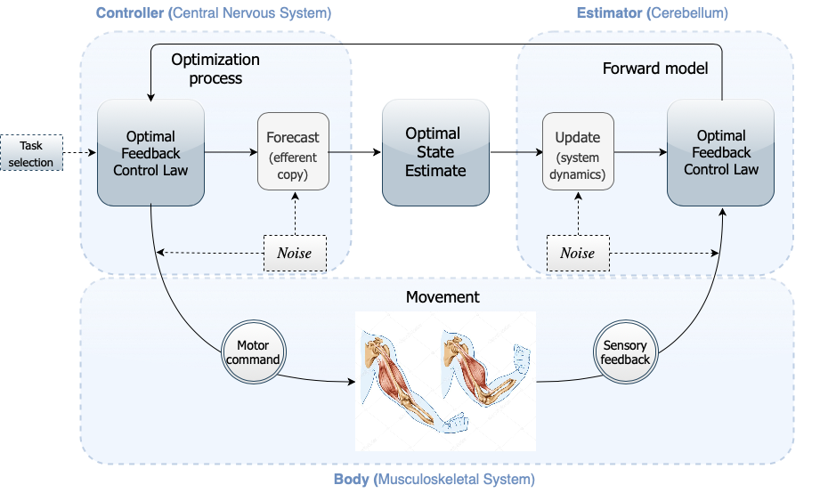

# The Dynamics of Motivated Decision-Making

## Project proposal and motivation

Movement is the only way to express our thoughts and moods, which in its full expression determines our overall behaviour. A vast amount of research has been devoted to study how the brain generates and controls movement over the last century. However, recent studies are gradually relating the motor act, including speech, in the context of computational principles that have been most often related to economic decisions. Specifically, recent studies have described the generation and control of movements in terms of the benefits and costs associated between with potential movements, thus establishing a fundamental relationship between movement generation and decision-making theory. Furthermore, the study of the principles underlying how the brain generates movement are of significant relevance both from a scientific but also clinical perspective, as most disorders are often quantified in terms of the motor deficits they imply, e.g., Parkinson’s disease, ictus or simple ageing.

The combination of movement related choices and more cognitive decisions determines our responses and the behaviour with which we interact with the environment. This can be studied and modelled mathematically through optimal decision making and motor control theory. However, these theories fall short to consider the contribution and role of the inner perception of our body, namely the bodily perception or proprioception, which plays a crucial role when planning and executing movements.
In particular, proprioception provides internal corroboration that a movement is ongoing, it is hence a distributed phenomenon implicated in processes of top-down prediction and bottom-up correction, consistent with the hypothesis of distributed network implementing a bodily-reference framework that branches into brain areas other than the somatosensory cortex. However, the state-of-the-art motor control models have not yet characterised how the dynamics of proprioception internally contribute to the selection of specific movements, nor have yet explained how this relationship is distributed across the hypothetical proprioceptive network. Understanding the neural basis of movements and decisions and reconciling this with our sense of bodily perception into a single theory is not an easy task but is a major requirement to ultimately design directed neurorehabilitation techniques and to provide a principled view to neurodegenerative motor symptoms. 

Despite its obvious practical and clinical importance, proprioception remains one of the least studied senses, often overshadowed by its more familiar counterparts. Hence, **the main goal of the project we present is to develop a unifying theoretical framework of proprioception, motor control and decision-making**. 

### State of the Art

**Optimal Feedback Control (OFC)** is a prominent theoretical framework in the study of motor control, aiming to understand how humans make motor decisions and execute movements efficiently. In latest work on this topic, OFC posits that motor behavior can be modeled as an optimization process where the central nervous system (CNS) minimizes a cost function. This cost function typically includes terms for error minimization, effort, and sometimes other factors like variability and noise. The OFC architecture contains a **controlled object**, in this case the **body**, whose dynamics can be described by means of **Hamiltonian dynamics**; a **controller**, this is the CNS which is an **optimal feedback controller** conducting the **optimization process**, and an **optimal state estimator** that combines commands and sensory feedback to obtain a state estimate according to the **forward model**. 

## Model Implementation

Firstly, the optimization process is computed as analytically specified on the aforementioned Chapters. Secondly, the optimal time duration and controller determine the functional in order to compute the bottom-up correction step as a means to update the previous prediction. Hence, the optimal state is used to predict the following trajectory, which may be sequentially filtered again. This sequential approach is implemented in order to learn the biomechanical parameters of the model, as a means to simulate trajectories close to the experimental ones.

## Repository content

The repository structure is based on 
- **Implementation** folder: contains the specific files with the defined functions for the singular subject study and for all the dataset study as well as the main functions needed for compiling the full implementation. More explicitly: 
    - `main.py` main compilation file, for a singular subject study.
    - `main_mulitple.py` main compilation file, for the whole data set, regarding subjects 25 to 36. 
    - `utils_data.py` file with the defined functions for data exploration and preprocessing, for a singular subject study.
    - `utils_data_multiple.py` file with the defined functions for data exploration and preprocessing, for the whole data set, regarding subjects 25 to 36. 
    - `utils_model.py` file with the defined functions for the optimization process, forward model, parameter fitting, as well as the simulation of the filtered trajectories, for a singular subject study.
    - `utils_model_multiple.py` file with the defined functions for the optimization process, forward model, parameter fitting, as well as the simulation of the filtered trajectories, for the whole data set, regarding subjects 25 to 36. 
- **Notebooks** folder: contains the notebooks where the code can also be implemented. 
 

